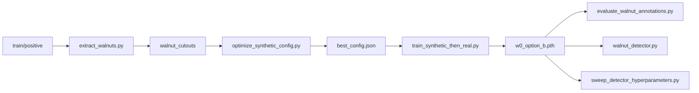
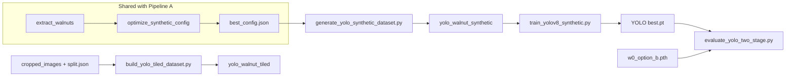

# Walnut Detection

End-to-end tools for detecting and counting walnuts in orchard images. The repo supports two complementary approaches:

1. **Patch classifier pipeline** — A small CNN classifies 32×32 patches; a sliding-window detector finds walnuts in full images.
2. **YOLO + classifier pipeline** — YOLOv8 proposes regions on tiled full images; the same patch classifier filters false positives.

Both paths share synthetic data generation (cutouts composited onto backgrounds) tuned with Optuna.

---

## Quick start

```bash
cd Walnut-detection
python3 setup.py
source venv/bin/activate   # Windows: venv\Scripts\activate
```

All training and inference scripts accept `--device auto` (CUDA if available, else MPS, else CPU). Use `--device cuda` to force an NVIDIA GPU.

```bash
python <script>.py --help
```

---

## Repository layout

### Scripts (by role)

| File | Role | When to use |
|------|------|-------------|
| **Setup & utilities** | | |
| `setup.py` | Create `venv/`, install `requirements.txt`, verify imports | First time on a new machine |
| `device_utils.py` | Shared CUDA/MPS/CPU selection (`resolve_device`, etc.) | Imported by other scripts; not run directly |
| `requirements.txt` | Python dependencies | Installed by `setup.py` |
| **Data preparation** | | |
| `extract_walnuts.py` | Cut RGBA walnut patches from `train/positive/` → `walnut_cutouts/` | Before synthetic config search or YOLO synthetic data |
| `build_yolo_tiled_dataset.py` | Tile full images into 640×640 YOLO crops + labels | Before training/evaluating tiled YOLO on full-resolution images |
| **Synthetic config & generation** | | |
| `optimize_synthetic_config.py` | Optuna search for best compositing/augmentation settings | Stage 1: after cutouts exist; produces `optuna_results/best_config.json` |
| `generate_yolo_synthetic_dataset.py` | Build YOLO dataset from `best_config.json` | After Stage 1; before `train_yolov8_synthetic.py` |
| `refine_synthetic.py` | Optional CycleGAN pass (synthetic → real style) | Optional; if you have `cyclegan_models/G_AB_best.pth` |
| **Classifier training** | | |
| `binary_classifier.py` | Train classifier on patch folders only (no synthetic pipeline) | Standalone training when you already have `positive/` + `negative/` |
| `train_synthetic_then_real.py` | Synthetic pretrain → real fine-tune (multi-phase, hard mining) | Main classifier training path after Stage 1 |
| **Classifier detection & eval** | | |
| `walnut_detector.py` | Sliding-window detector on full images (library + CLI) | Inference on new images; used internally by eval scripts |
| `evaluate_walnut_annotations.py` | Precision/recall/F1/MAE vs GT centre annotations | After you have a `.pth` and `split.json` |
| `sweep_detector_hyperparameters.py` | Grid search stride/threshold/NMS on a split | Tune detector settings before final eval |
| **YOLO training & two-stage eval** | | |
| `train_yolov8_synthetic.py` | Train YOLOv8n on synthetic YOLO dataset | After `generate_yolo_synthetic_dataset.py` (or with `--generate`) |
| `evaluate_yolo_two_stage.py` | YOLO proposals + classifier filter + metrics | After YOLO `.pt` and classifier `.pth` exist |

### Expected data directories (not in git)

Create or copy these under the repo root (e.g. from a parent `synthetic model` project):

| Path | Purpose |
|------|---------|
| `train/positive/`, `train/negative/` | Real 32×32 patches for training |
| `val/positive/`, `val/negative/` | Optional validation patches |
| `walnut_cutouts/` | RGBA cutouts from `extract_walnuts.py` |
| `cropped_images/` | Full images for detection eval / tiling |
| `annotated_images/` | One `.txt` per image (walnut centre coordinates) |
| `split.json` | `train` / `val` / `test` image stem lists |
| `models_finetuned/walnut_classifier_best_precision.pth` | W0 pretrained weights for Optuna / synthetic training |
| `optuna_results/best_config.json` | Best synthetic config from Stage 1 |
| `optuna_results/w0_option_b.pth` | Classifier from `train_synthetic_then_real.py` |
| `cyclegan_models/G_AB_best.pth` | Optional CycleGAN for `refine_synthetic.py` |
| `yolo_walnut_synthetic/` | Synthetic YOLO dataset output |
| `yolo_walnut_tiled/` | Tiled real-image YOLO dataset |
| `yolo_runs/` | Ultralytics training outputs |

---

## Pipelines

### Pipeline A — Patch classifier (recommended baseline)

Best when you want a lightweight detector and already have (or can build) patch datasets and full-image annotations.



| Step | Command | Output |
|------|---------|--------|
| 0 | Prepare `train/`, `val/`, annotations, `split.json`, W0 weights | — |
| 1 | `python extract_walnuts.py --train_dir train --output_dir .` | `walnut_cutouts/` |
| 2 | `python optimize_synthetic_config.py --n_trials 100 --device auto` | `optuna_results/best_config.json` |
| 3 | `python train_synthetic_then_real.py --device auto` | `optuna_results/w0_option_b.pth` |
| 4a | `python sweep_detector_hyperparameters.py --model_path optuna_results/w0_option_b.pth ...` | Best stride/threshold |
| 4b | `python evaluate_walnut_annotations.py --model_path optuna_results/w0_option_b.pth ...` | P/R/F1/MAE |
| 5 | `python walnut_detector.py --model_path ... --image_dir ... --output_dir ...` | Overlays + JSON |

**Alternative at step 3:** train only on real patches with `binary_classifier.py --dataset_dir train`.

---

### Pipeline B — YOLO + patch classifier (two-stage)

Best when walnuts are small in full frames and you want YOLO to propose regions, then the classifier to reject false positives.



| Step | Command | Output |
|------|---------|--------|
| 1–2 | Same as Pipeline A (cutouts + `best_config.json`) | — |
| 3 | `python generate_yolo_synthetic_dataset.py --mode patch --num_images 5000` | `yolo_walnut_synthetic/` |
| 4 | `python train_yolov8_synthetic.py --data_dir yolo_walnut_synthetic --device auto` | `yolo_runs/.../weights/best.pt` |
| 5 | `python build_yolo_tiled_dataset.py` | `yolo_walnut_tiled/` |
| 6 | `python evaluate_yolo_two_stage.py --yolo_model_path ... --clf_model_path optuna_results/w0_option_b.pth ...` | Metrics |

One-liner for steps 3–4:

```bash
python train_yolov8_synthetic.py --generate --num_images 5000 --epochs 100 --device auto
```

You still need a trained classifier (Pipeline A step 3) for step 6.

---

### Pipeline C — Optional CycleGAN refinement

Use only if you have a trained `G_AB` checkpoint and want synthetic patches to look more “real” before training.

```bash
python refine_synthetic.py --output_dir . --device auto
```

Expects `synthetic_patches/images/` and writes `synthetic_patches_refined/`. `optimize_synthetic_config.py` can also use CycleGAN in-memory when `cyclegan_models/G_AB_best.pth` exists.

---

## Which script when?

| Goal | Script |
|------|--------|
| First-time environment | `setup.py` |
| Build cutouts for compositing | `extract_walnuts.py` |
| Find best synthetic generation settings | `optimize_synthetic_config.py` |
| Train the main walnut classifier | `train_synthetic_then_real.py` (full pipeline) or `binary_classifier.py` (patches only) |
| Run detector on new images | `walnut_detector.py` |
| Measure detection quality on a split | `evaluate_walnut_annotations.py` |
| Tune stride/threshold/NMS | `sweep_detector_hyperparameters.py` |
| Train YOLO on synthetic data | `generate_yolo_synthetic_dataset.py` → `train_yolov8_synthetic.py` |
| Build real tiled YOLO data | `build_yolo_tiled_dataset.py` |
| Evaluate YOLO + classifier together | `evaluate_yolo_two_stage.py` |
| Style-transfer synthetic patches | `refine_synthetic.py` |

---

## Device usage

All GPU scripts use `device_utils.py`:

| `--device` | Behavior |
|------------|----------|
| `auto` (default) | CUDA → MPS → CPU |
| `cuda` | NVIDIA GPU (falls back with warning if unavailable) |
| `mps` | Apple Silicon |
| `cpu` | CPU only |

Example:

```bash
python train_synthetic_then_real.py --device cuda
python evaluate_walnut_annotations.py --model_path optuna_results/w0_option_b.pth \
  --image_dir cropped_images --annotation_dir annotated_images \
  --split_file split.json --split test --device auto
```

---

## Core modules (imported, not CLI)

| Module | Exports / role |
|--------|----------------|
| `binary_classifier.py` | `WalnutClassifier`, `BinaryWalnutDataset`, `mine_hard_negatives`, `mine_hard_positives`, training helpers |
| `walnut_detector.py` | `WalnutDetector` sliding-window API |
| `evaluate_walnut_annotations.py` | `evaluate_dataset`, `parse_annotations`, `match_detections` |
| `optimize_synthetic_config.py` | Synthetic batch generation, W0 fine-tune helpers (imported by `generate_yolo_synthetic_dataset.py`, `train_synthetic_then_real.py`) |
| `refine_synthetic.py` | `Generator32` for CycleGAN |
| `device_utils.py` | `resolve_device`, `add_device_argument`, `ultralytics_device` |

---

## Typical file outputs

| Output | Produced by |
|--------|-------------|
| `optuna_results/best_config.json` | `optimize_synthetic_config.py` |
| `optuna_results/w0_option_b.pth` | `train_synthetic_then_real.py` |
| `val/best_model.pth` | `train_synthetic_then_real.py` (if `val/` exists) |
| `yolo_runs/<name>/weights/best.pt` | `train_yolov8_synthetic.py` |
| `logs/search_*.log` | `optimize_synthetic_config.py` |

---

## Troubleshooting

| Issue | Check |
|-------|--------|
| `ModuleNotFoundError` | Run `python3 setup.py` and activate `venv` |
| Missing `best_config.json` | Run `optimize_synthetic_config.py` first |
| Missing `train/positive` | Add real patch data or fix `--train_dir` |
| CUDA not used | `python -c "import torch; print(torch.cuda.is_available())"`; pass `--device cuda` |
| YOLO train fails | `pip install ultralytics`; ensure `yolo_walnut_synthetic/images/train` exists |

---

## License

Add your license here if applicable.
